# **SPACK**

The environment’s user input file (or manifest), is named
spack.yaml. The lock file, which contains the
fully configured and concretized specs, is named
spack.lock

I can create an env also from a spack.yaml file or a
spack.lock file

## **Basic Installation240 **

git clone --depth=2 --branch=releases/v1.1
https://github.com/spack/spack.git ~/spack

[<u>https://spack-tutorial.readthedocs.io/en/latest/tutorial_basics.html</u>](https://spack-tutorial.readthedocs.io/en/latest/tutorial_basics.html)

***Avviare*** spack-stack da spack-stack/setup.sh

*Creare* ambiente “linux.local” da file template
/spack-stacks/configs/templates/unified-dev (più esteso) e “site”
linux.default

*Avviare* ambiente da envs/\<ambiente\> “***spack env activate -p .***”

*spack add mysql@80.33 (è una spec:* una spec è l’indicazione di un
pacchetto con le sue dipendenze)  
**Before installing a package in an environment we need to add the
package.**

we can add a package in the spack.yaml-\> *spack concretize (*controlla
correttezza dipendenze)

It is possible I install a version of python or of another package
incompatible with a next package so after adding the new package I have
to concretize so that the version of python downgrades to one compatible
with the new package.

**We can create an environment with the files in a custom
directory(independent environment)**

spack env create -d .

this env will not show up in spack env list

*spack install tcl ^zlib-ng@2.0.7 %clang*

we want use the dependency zlib-ng@2.0.7 instead of the default

togliere package da env-\>spack remove package (no uninstall crea
conflitto con altri env)

**Reproduce and environment**

Using spack.yaml we rebuild a new env but witch changes in the
dependencies occurring at build time, with spack.lock we reproduce the
exact same env.

Build a module from package  
[<u>https://spack-tutorial.readthedocs.io/en/latest/tutorial_modules.html</u>](https://spack-tutorial.readthedocs.io/en/latest/tutorial_modules.html)  
serve per i moduli: spack install lmod

*spack module tcl refresh*

*spack module lmod refresh*

le impostazioni per la creazione dei moduli sono in /configs/common

**Including environments**

You can also include an env1 inside a newly created env2 and see from
env2 the root(of env2) and included(of env1) packages in it. When we
update env1 we don’t see changes from env2 if we do not concretize env2.

We can create a mirror of a concretized environment

*spack env activate myenv*

*spack mirror create -a*

## DOCUMENTAZIONE

[<u>https://spack.readthedocs.io/en/latest/configuration.html</u>](https://spack.readthedocs.io/en/latest/configuration.html)

# **JEDI**

Jedi is a module for DA

## GENERAL ARCHITECTURE

Methods and classes are templated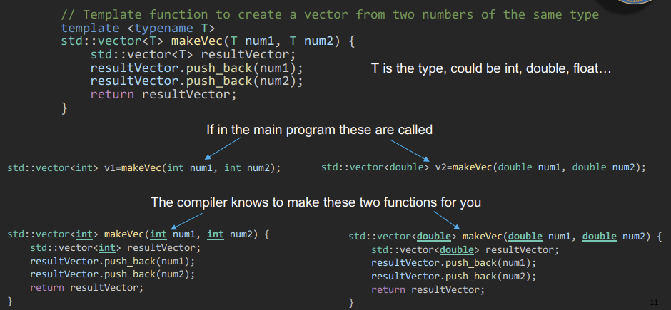

We make an example of the use of traits. We have an abstract class with
a virtual method “print” that takes as input an output stream

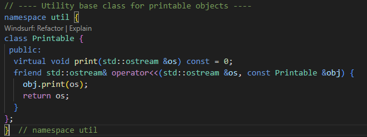  
We then have a concrete implementation of a templated class with a
method sayHello()

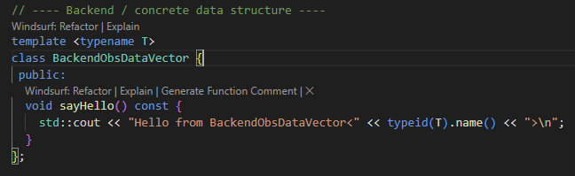

Then there is traits class that decides what backend to use, inject
types in a interface so that these two are decoupled

And finally the interface that uses the trait. This class must have a
concretization of the method print of the Printable mother class.  
Inside the class we recall the type (that is template) of the backend
implementation through the use of the trait as a bridge between the
interface and the backend to create the type (**just as alias**)
*ObsDataVec\_*

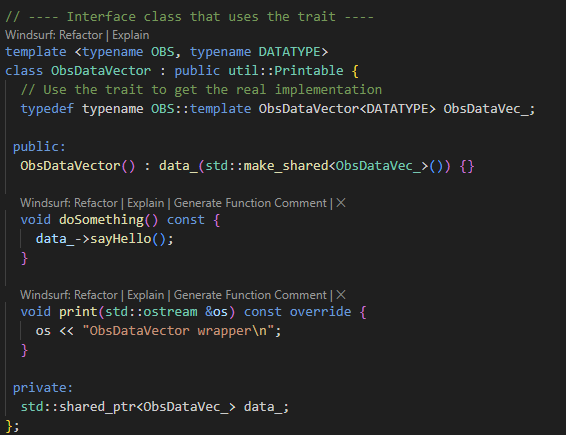

We have a smart pointer that points to an object of ObsDataVec\_ type.

## **ECKIT **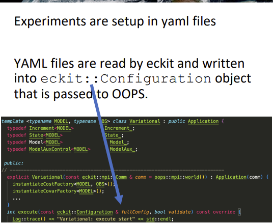

/config/  
  
**atlas**

atlas/field.h

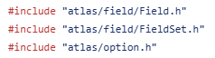

Field.h: basically a field is a wrapper of a simple array with metadata
in addition, related to the grid and positioning of data. The Field
object can be initialized in different manners, from a config or from
name and shape or from raw data.

MultiField.h: collection of multiple fields.

## -**OOPS:** 

Source:
[<u>https://jointcenterforsatellitedataassimilation-jedi-docs.readthedocs-hosted.com/en/latest/inside/jedi-components/oops/index.html</u>](https://jointcenterforsatellitedataassimilation-jedi-docs.readthedocs-hosted.com/en/latest/inside/jedi-components/oops/index.html)  
The DA task are defined as subclasses of oops::Application

Object Oriented Prediction System (top level code component)

OOPS provides these applications: it doesn't hardcode the model inside
but chooses at compile time, it’s a framework.

The object oops::Run has a method execute() that takes as object a
oops::Application

**OOPS INTERFACES**

There are three implementations of OBS traits in JEDI.  
The base class in /base/Geometry.h implements the interface in
/interface/Geometry.h

Some classes do not need to have additional features so they are just
located in /interface/ (like ObsOperator or VariableChange)

### **/src/oops/base** 

**/variables_mod.F90**

Definition of the module **oops_variables_mod** is in

mpas-bundle/oops/src/oops/base/variables_mod.F90, the file
oops_variables_mod.mod will be needed to compile other fortran files

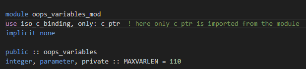

What does this module do? It is a wrapper around a c++ variable  
Stores lists of variables, interaction with c++ objects

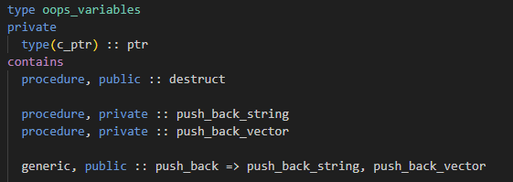

\#include "oops/base/variables_interface.f"

this is the inclusion where are declared the c++ functions(not defined)
called by the fortran subroutines. This file does not implement anything
is just for the binding, it is not in the CMakeList list of appended
files because is included in variables_mod.f90

The methods of the type oops_variables are not inherited from c_ptr
cause this is just a type, you cannot call ptr%some_methods.

I have a Fortran defined type oops_variables that internally has
methods: actually these methods are not responsible for storing data in
the c++ object pointed by the pointer ptr but they call c++ functions.

For example:

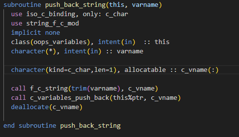

varname is the name of the Fortran variable I want to add

-intent(in) means that I cannot modify the reference to this but only
the object pointed to by this%ptr

-f_c_string is a conversion from fortran to c++ string format

-c_variables_push_back is the call to the backend function that stores
the variable in the c++ object

The variables_mod.f90 fortran functions call other fortran functions
binded to actual c++ functions in variables_f.cc that is in the same
folder /src/oops/base.

**In the end it is a 3 layer work**

- AnaliticInit: initialises analytically GeoVals

-  style="width:4.70313in;height:1.09375in" />

- GetValues.h: Fills GeoVaLs with requested variables at obs locations
  > during model run

-\>fillGeovals obtains the model state interpolated at obs location

-\>fillGeovalsTL obtains the deltaX of the model state interpolated at
obs location to have deltaY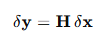

-\>fillGeovalsAD is useful to recover deltaX from deltaObservations

**The interpolation is made to obtain a state at the time of the
observation(linear/nearest) and at its location**

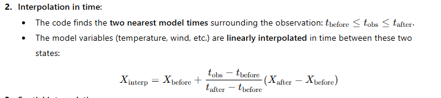

- Departures: calculates the difference between simulated and observed
  > variables on ObsSpaces storing such difference in ObsVector y=d-H(x)

- DiagonalMatrix: generalization of diagonal matrix

- FieldSet:

- LinearModel:

- Model: manages the use of the model, the full forecast cycle

**Locations.h:**

**Variable.h:** we have a custom type defined via an enum class so that
we have fixed options.

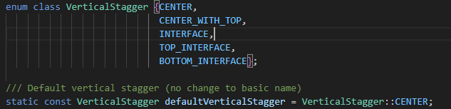  
Then we have the type of data that can be holded

Then we have a class for the VariableMetadata. The VariableMetadata
holds the info **about how is staggered, the type of the variable and
the domain(atmosphere, ocean, land)**  
These are the copy, move and the default constructor

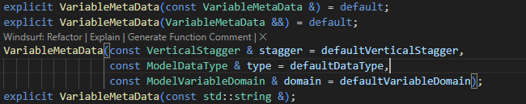

Then we have public getter functions that return a reference to a
private member

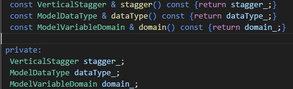

Class for Variable:

a Variable object has a method name() that returns the private variable
varName (which type is VariableMetaData), a method to get and set the
number of vertical levels and methods to get MetaData, stagger and
datatype.

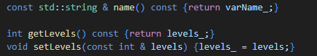

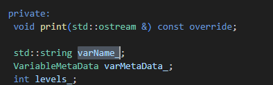

Such Variable can be created by different constructors, by a string, by
a name, metadata and number of levels or from a config file.

There is a part to hash a custom object oops :: Variable hashing its
name. Hashing is a way of finding faster an object

[<u>Variable.cc</u>](http://variable.cc): the construction of a
VariableMetadata can be done passing (stagger, type, domain) or with
default values.

### **Variables.h:** 

A Variables object is a container of Variable object, each Variable
object represents a single data field like temperature, humidity, bT
etc.. and its associated Metadata like Name, Levels…

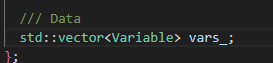this stores all the Variable
objects.

An object Variables can be constructed in various ways:

From a list of strings, from a vector of Variable objects…

The objects of a Variables can be accessed by the operators implemented
by index vars\[0\], name vars\[“T”\] or listing them vars.variables().

There are some methods to check the existence of objects inside
vars.has(), to add and remove new objects.

###  **Variables.cc:**

VariablesBase.h: used to manage variables names. has methods that return
number of variables, access variables, check if a variable exist, add
variable.  
[<u>VariableBase.cc</u>](http://variablebase.cc): implementation of
methods defined in VariableBase.h file  
  
ObsVariables.h(import VariablesBase.h): extends VariableBase for
observations from satellite

[<u>ObsVariables.cc</u>](http://obsvariables.cc): the name of the
variable is “var + channel”

**ObsSpaceBase.h**: this is the base for the observation space
representation. The constructor takes as input a config file, time
windows…

ObsSpaces.h: instantiate a vector of ObsSpace object called spaces\_

**/src/assimilation  
**CostFunction.h→there is the Factory for the cost function creation, an
argument of create() is the config yaml file part “cost function” by
managed by eckit

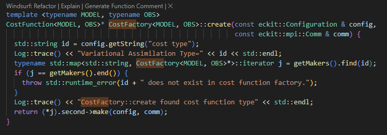  
CostFct4DVar.h

**/src/oops/runs  
**Application.h-\>it’s the base class for executable applications

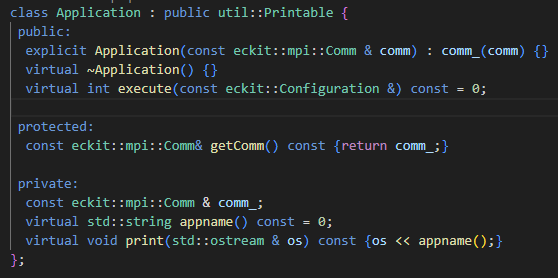

what the Application does is defined in the method execute

Variational.h → inherits from Application, \#include
/assimilation/CostFunction.h

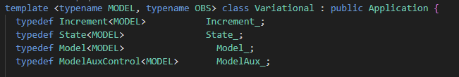

build a CostFunction object J

### **/src/oops/interface**

**OOPS applications interact with specific model or observation
implementations through interface classes.**

**Geometry.h** (includes /base/Variables.h): can contain info about the
model resolution, gridpoints,

The geometry constructors builds it from yaml file, retrieves vertical
coordinates.

The method *variableSizes*: returns the number of values required to
store each of the passed model variables at a single location, like the
number of vertical layers.

**GeoVals.h: geovals are the variables provided by the model and
ObsVector has the observation data.  
** includes the /interface/ObsSpace.h that is the actual implementation
of the IODA space. Fill an object with location, variables and size.

**SampledLocations.h:** the class SampleLocation is templated on OBS, we
have the actual backend definition of the class.  
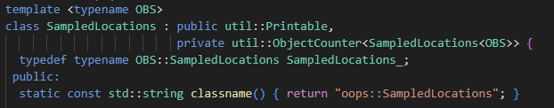

There are the accessor to longitude, latitude and time of the sampled
location.

**State.h:** represents the model state, a set of variables at a certain
resolution.

**ObsSpace.h:**

ObsSpace\_ is an actual implementation of a backend like IODA  
  
[<u>ObsSpace.cc</u>](http://obsspace.cc):

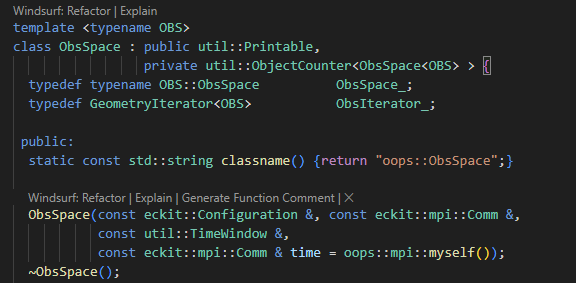

obsdb\_ holds the real implementation

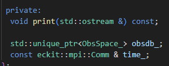

we have methods that return observation variables/those used for
assimilation, the time window boundaries, the name of the obs
type(satellite, radar).

*After the declaration of the class and the methods, we have the
definition. This because in template classes the compiler must see the
declaration and the definition when the template is istantiated so we
cannot put the definition in a .cc document.*

**ObsVector.h**: la instanza dell'oggetto di tale classe rispetta il
pattern CRTP dove la istanza eredita feature da un'istanza della classe
template con sé stessa. (The instance of a ObsVector object heredits the
features of an ObjectCounter instantiated with a ObsVector type.)  
The data contained on such a vector are not templated DATATYPE.

This class represents the data inside a vector.

Creates an ObsVector from an ObsSpace reading the specified “name”
variable or with another method we can wrap an existing one.

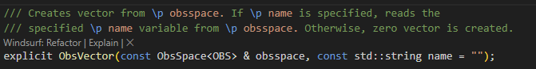

In /ioda/src there is an actual implementation of ObsVector.h

**ObsDataVector_head.h**: this is like a wrapper around a backend where
the type of the instance is determined by a trait class. The type of
data retained are templated DATATYPE.  
Here there are two forward declarations of two objects that belong to a
type that wraps around ObsDataVector_head.h, this works with just the
declaration and if I do not access the internal methods of the objects.

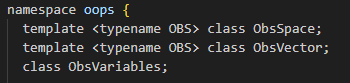

There is a class ObsDataVector where the implementation is made via
traits and the internal creation of a type ObsDataVec\_ that recall the
backend implementation.

Creation of ObsDataVector associated to a ObsSpace and ObsVariables,
there is also the copy constructor, creation of ObsDataVector from
another ObsVector for example for numeric conversion.

**ObsDataVector.h:** definition of the declarations in
ObsDataVector_head.h  
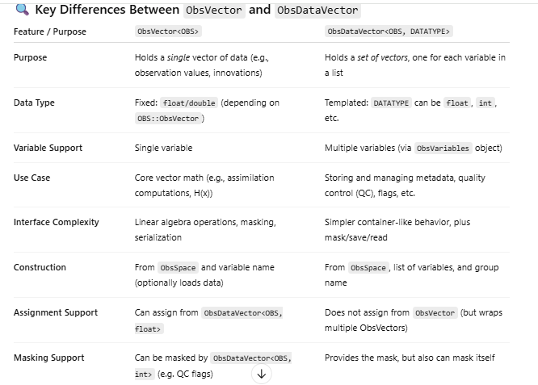

### **/src/oops/util**

Printable.h: class that has a print method but has to be implemented in
every derived class.

ObjectCounter.h: keeps track of the instances of a class T

### **/src/test/**

#### **/interface**

ObsOperator.h  
The testConstructor() here fails if I add arbitrary voices in the yaml
file….

this iterates on the various obs spaces

**MPAS-MODEL**

Tutorial di HOWARD2024:
[<u>https://www2.mmm.ucar.edu/projects/mpas-jedi/tutorial/202410HOWARD/</u>](https://www2.mmm.ucar.edu/projects/mpas-jedi/tutorial/202410HOWARD/)

in locale: mpiexec -n 1 ../mpas-build/bin/mpasjedi_hofx3d.x
./hofx3d.yaml

**APPLICATIONS:**

*Applications running forecasts:*  
-**Forecast:** generic application to run forecast from initial
conditions.

\-**HofX:** model forecast and compute H(x). There HofX3d and HofX4d,
the last one computes H(x) on a set of model states computed via
model.  
We can perturb the output of a H(x) with some observation error
statistic like it is an instrument and save the result as observation
(OSSE)

*Data Assimilation applications:*

-Variational:

-Local Ensemble:

*HofX applications:*

*Generate Hybrid TLM coefficients:*

[<u>https://jointcenterforsatellitedataassimilation-jedi-docs.readthedocs-hosted.com/en/latest/inside/jedi-components/oops/applications/gen-hybrid-linear-model-coeffs.html</u>](https://jointcenterforsatellitedataassimilation-jedi-docs.readthedocs-hosted.com/en/latest/inside/jedi-components/oops/applications/gen-hybrid-linear-model-coeffs.html)

[<u>https://journals.ametsoc.org/view/journals/mwre/149/1/mwr-d-20-0088.1.xml</u>](https://journals.ametsoc.org/view/journals/mwre/149/1/mwr-d-20-0088.1.xml)

*Algorithms Details:*

-OOPS linear equations solver: I need to solve the least square problem
for Ax=b to find the coefficients for every row of the TLM or of the
STLM.

*OOPS Interfaces:*

## -**IODA:** 

### **General structure**

[<u>https://jointcenterforsatellitedataassimilation-jedi-docs.readthedocs-hosted.com/en/latest/inside/jedi-components/ioda/index.html</u>](https://jointcenterforsatellitedataassimilation-jedi-docs.readthedocs-hosted.com/en/latest/inside/jedi-components/ioda/index.html)

Interface for Observational Data Access, ingest and process
observational data. *Data are converted in **IODA data model** so they
are accessed through one single API.* The data are provided to OOPS and
UFO (clients of IODA) through an interface, in UFO they can be trimmed
down and filtered.

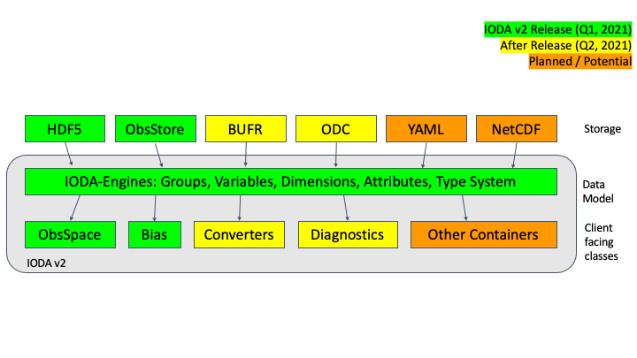*  
*UFO takes the info about location from IODA to calculate H(x) and OOPS
take y from IODA to calculate H(x)-y in minimization processes.

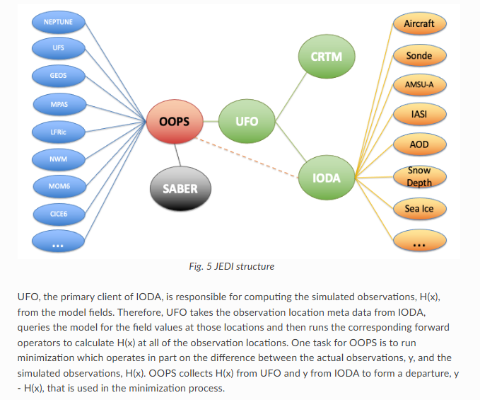

*  
*IODA has ObsSpaces-\>initialize multiple ObsSpace, each ObsSpace is
associated to different observational operator.

Both y and H(x) are ObsVector. Two Observation object are created to
hold y and H(x), an Observer object is created to transform x-\>H(x)

**IODA DATA MODEL DETAILS:** this format is composed of three classes.
Organized like a filesystem with Groups(folders), Variables(files) and
Attributes. Variables are the values of wind, brightness_t and others,
the Attribute can be referred to a Group or a Variable.

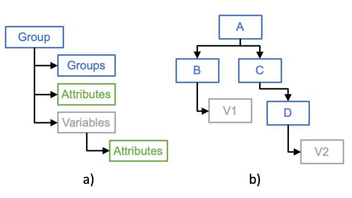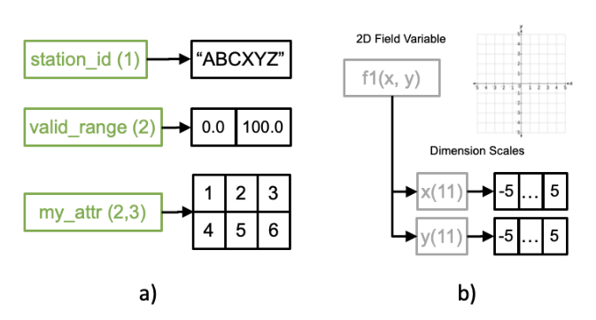

The dimensionality of a Variable is called DimensionScales (from -5 to
+5 in fig.)  
The declaration of Group and ObsGroup is in
/ioda/src/engines/ioda/include/ioda/.

**Each IODA ObsSpace instantiated by the OOPS class ObsSpaces is
associated with a UFO ObsOperator**

**IODA INTERFACES**  
MetaData Array contains info about the measurements such like location,
datetime, stationIdentification

Additional MetaData: contains more specific info about the instrument
like the channel frequencies etc..

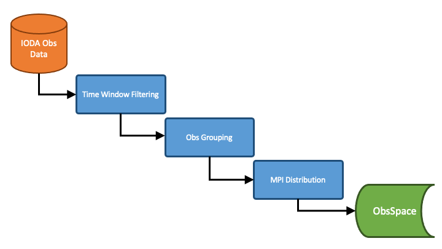

Time filtering-\>by default every location has an unique “record” (no
grouping) \<in the yaml we can group by location\> -\>these records are
given to MPI tasks.

The variables simulated, that will be assimilated, are read from
ObsSpace and mapped in ObsVector. The object ObsVector has read() and
save methods().

### 

#### **IODA OBJECTS**

[<u>ObsVector.cc</u>](http://obsvector.cc)  
I can build an ObsVector from a ioda::ObsSpace and a Metadata like
“ObsValue” with the constructor

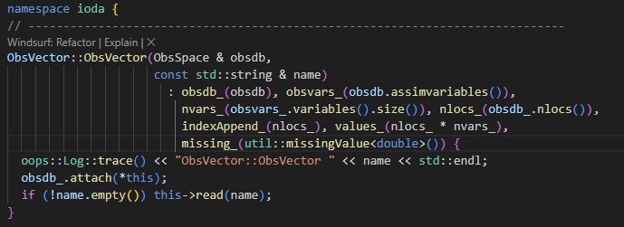

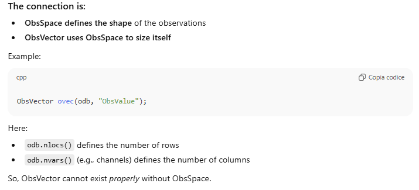

#### **IODA FILE FORMATS **Ioda needs hdf5 file format: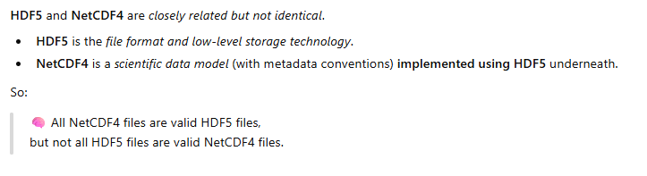** **You see that the netcdf file is more rigid in the structure, the dimension of variables is fixed, the hdf5 is more like a filesystem where you can store data of the dimension you want. 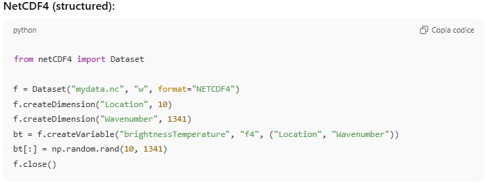** **

#### FILE: ascat_obs_2018041500.h5

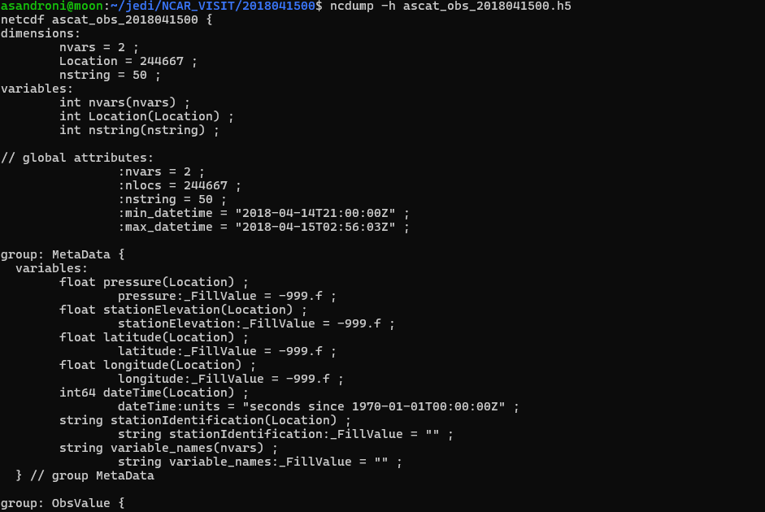

dimensions and variables are root level attributes.

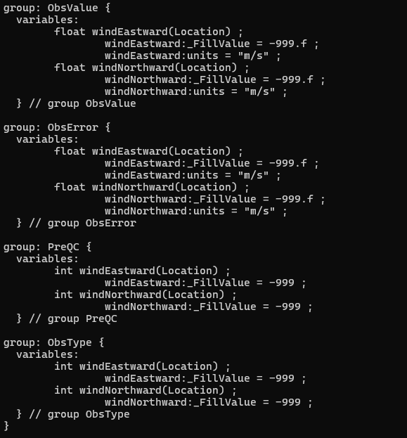

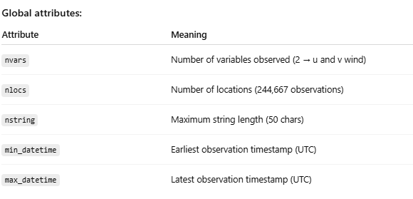

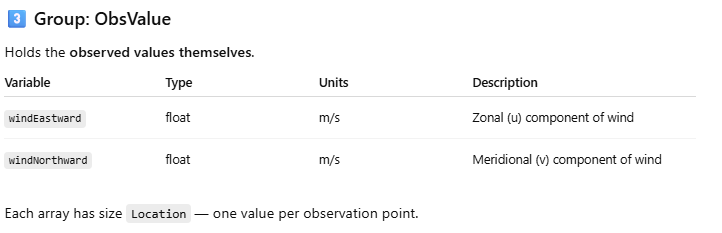

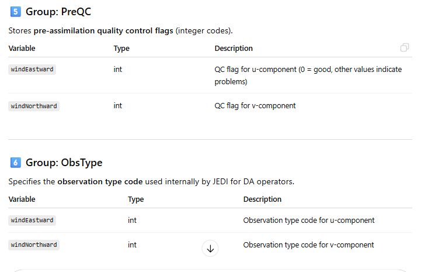

### **Construction of the obs space**

#### [<u>ObsSpace.cc</u>](http://obsspace.cc) ioda/src

The ObsSpace contains the data of the observations, metadata, locations…

**IODA-OOPS INTERFACE:  
  
**ObsVector of IODA is mapped in a ObsVector in OOPS

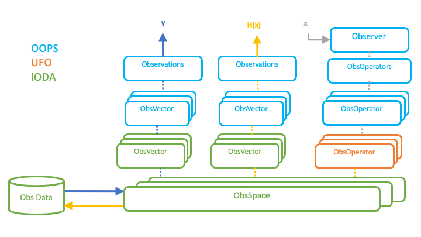

## -**UFO: **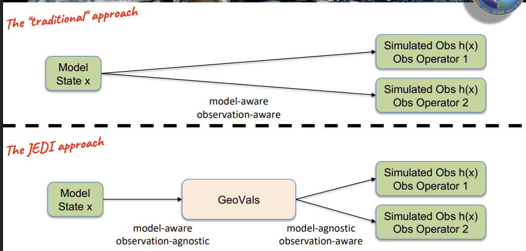

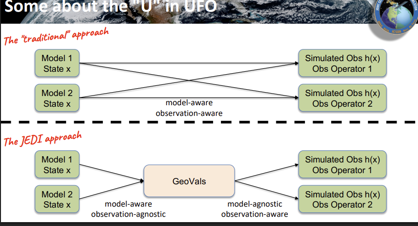

## **H(x) test**

To run hofx we run from /hofx/

export
bundle_dir=/glade/derecho/scratch/liuz/mpas_bundle_v3.0.2_public_gnuSP

export LD_LIBRARY_PATH="\${bundle_dir}/build/lib:\${LD_LIBRARY_PATH}"

export GFORTRAN_CONVERT_UNIT='big_endian:101-200'

mpiexec ./mpasjedi_hofx3d.x ./hofx3d.yaml ./mpasjedi_hofx3d.log

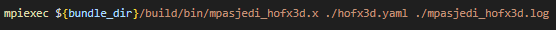

where the namelist.atmosphere_240km and streams.atmosphere_240km are
needed cause H(x) needs to reconstruct the grid and the vertical levels
and these info are in these yaml files:

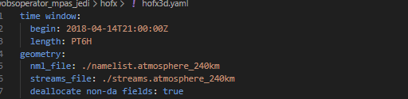

the variables to be retrieved from the netcdf mpas background produced
by MPAS are

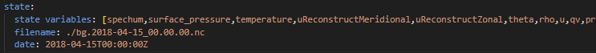

such names are mapped to the ones in the background file and to the ufo
ones via the geovars.yaml file

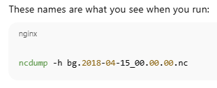

in the background file I have the maps template fields

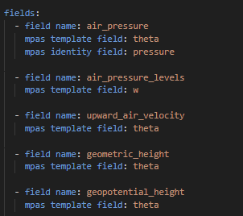

in /ufo/src/ufo we have:

## **MODULES** 

**ufo_vars_mod** in ufo/src/ufo/ufo_variables_mod.F90 (no types defined
here)

**ufo_geovals_mod** in ufo_geovals_mod.F90

definition of the fortran type ufo_geoval

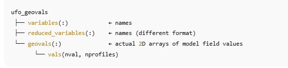

**ufo_constants_mod** in ufo_constants_mod.F90 (no types defined here)

**ufo_geovals_mod_c** in /ufo/src/ufo/GeoVals.interface.F90

[<u>ObsOperator.cc</u>](http://obsoperator.cc): here is read the
configuration file, selected the right class for the operator, if in
name:CRTM then the class is ObsRadianceCRTM; so here is not computed the
physics but the right call is made.

**OBSERVATION PROCESS FLOW**  
Three types of meta-operators that can be called and when called they
manipulate the output.

**OBSERVATION OPERATORS**

*Categorical:* meta-operator: can call multiple observation operators to
produce H(x) each, to select an observation operator the “categorical
variable” has to be set.

*Composite:* this meta-operator collects a series of observation
operators where each one simulates a subset of variables from ObsSpace.

The observational data in input may be not regular as the one needed to
perform DA so we need an interpolation of the quantities we want to
simulate. The default interpolation method is the nearest-neighbour, you
associate the value of the variable equal to the closest of the present
data.

Interface with RTTOV:

[<u>https://jointcenterforsatellitedataassimilation-jedi-docs.readthedocs-hosted.com/en/latest/inside/jedi-components/ufo/obsops.html#rttov</u>](https://jointcenterforsatellitedataassimilation-jedi-docs.readthedocs-hosted.com/en/latest/inside/jedi-components/ufo/obsops.html#rttov)

  
In UFO is defined also the Identity operator, the product one to scale
quantities. We could need the value of H(x) where x is the wind speed at
10m on seasurface but the model lowest level is at 30m, so we scale x=30
to 10 and then calculate H(x).

### **  /operators/**

### **CRTM:**

**the crtm actual code is in →/code/crtm/**

Here is build the [<u>libcrtm.so</u>](http://libcrtm.so) library stores
in /build/lib/[<u>libsigma.so</u>](http://libsigma.so)

[<u>https://jointcenterforsatellitedataassimilation-jedi-docs.readthedocs-hosted.com/en/latest/inside/jedi-components/ufo/obsops.html#community-radiative-transfer-model-crtm</u>](https://jointcenterforsatellitedataassimilation-jedi-docs.readthedocs-hosted.com/en/latest/inside/jedi-components/ufo/obsops.html#community-radiative-transfer-model-crtm)

ufo/src/mains

structure of the repo ufo/src/ufo/operators/crtm:  
folder crtmParameters/

- ObsAodCRTMParameters.h: Aerosol Optical Depth

- ObsRadianceCRTMParameters.h:

> \#include "ufo/ObsOperatorParametersBase.h"
>
> this is a class for parameters object for all observation operators
>
> \#include "ufo/GeoVaLs.h"
>
> this is for having the model variables at obs locations
>
> 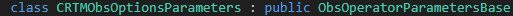 style="width:5.34375in;height:0.16667in" />
>
> and in /ufo/src/ufo/ObsOperatorParameterBase.h we have
>
>  style="width:4.77083in;height:0.23958in" />
>
> with Parameters.h in oops/src/oops/util/parameters/

escludendo l’Aerosol, no Aod files

//////////////////////////////////////////////////////////////////////////////////////////////////////////////////

Let start with the CRTM part for the calculation of radiances

and in ObsRadianceCRTM.interface.F90 are called the binded functions of
[<u>ObsRadianceCRTM.cc</u>](http://obsradiancecrtm.cc).

**The modules ufo_crtm_active/passive are used in
ufo_radiancecrtm_mod,** as **ufo_geovals_mod** that uses itself
**ufo_vars_mod**

Let’s start with the definition of the module **ufo_radiancecrtm_mod**,
where the crtm actual routines are called; here is defined a **type**
called ufo_radiancecrtm

#### ObsRadianceCRTM.interface.F90

Here we use the module ufo_geovals_mod defined in
/ufo/src/ufo/ufo_geovals_mod.F90

##### –Linked-list–

At the beginning we have the declaration and the implementation of the
linked-list methods. We want object that connect a key to a pointer to a
Fortran object

In the linkedList_i.f file we have the declaration of two types:
node_t and
registry_t

and in the definition head is a dummy pointer to the real first node of
the list.

In the linkedList_c.f file we have the definition of the routines
declared in the \_i file like:

the init\_ routine

the add\_ routine

The get\_ function

makes the pointer **ptr** given as argument to point to the internal

 object pointed by the node_t
object that has the same **key** as the given argument.

The remove\_ function removes a node from the linked list. We always
need prev, the pointer to the object previous to the one removed and is
needed to relink the list

From the
[<u>ObsRadiance.interface.cc</u>](http://obsradiance.interface.cc) we
call

trough this

.

–

this points to the Fortran
object CRTM,

but because c++ cannot hold pointers to Fortran objects we need a
registry where this Fortran object (rtm operator) is stored. We add the
fortran CRTM object to the registry:

then we have two config procedures

the parameters are passed to the CRTM object self

where inside

*go to ufo_radiancecrtm_mod*

Now the object self has varin populated and the channels to assimilate.

Remember that from the cc file we call the setup routine giving as
argument the variable varin\_ that is ioa::ObsSpace type still empty

and in the interface we wrap around the c++ pointer with a Fortran
object and initialize the internal variables c_varlist(pointer to the
c++ object varin\_)

the oops_variables has this method inside

this function takes as argument a pointer that in our case is c_varlist
(c_ptr) and initializes the value of the internal pointer of this to
c_varlist. The function returns “this” that is a oops_variables object
so finally we have a oops_variables object “oops_vars” with an internal
ptr initialized to the c_varlist pointer.

So up to now we have the variables in varin\_ but not
the values.

Now this

retrieved the geovals and the pointer “self” to the Fortran object

what happens inside simobs? see *ufo_radiancecrtm_mod*

In the [<u>ObsRadianceCRTM.cc</u>](http://obsradiancecrtm.cc)(where the
call comes from) we never see the Fortran object but just its key in the
registry

this is binded to the function in the ObsRadianceCRTM.interface.F90 file

and in this function the integer key is used to retrieve the Fortran
pointer to the ufo_radiancecrtm type object where the setup function can
be called

#### In [<u>ObsRadianceCRTM.cc</u>](http://obsradiancecrtm.cc):

##### **{detail} namespace there are all the options about the FOV**

here are liste the geovals to average on for the profiles inside the
fov

here are the default values for the variables that CRTM need if the obs
does not have it

  
qui è creato il nuovo ObsOperator, **registrato in UFO**

and then there is the declaration of a constructor(name of the function
same of the class) and of a list of initialisers run before the body,
varin\_ is created by the default constructor of oops::Variables
class.  
**Remember that I need to simulate a variable at obs
location so I need the location of obs and I know it trough observation
database ioda::ObsSpace odb**

In the body of the constructor we have the import of the variables to be
assimilated and the channels

Now some c++ functions are called and they are binded to fortran
routines in the interface file, varin\_ is and oops::Variables object
type that will be populated with GeoVals the fortran operator
requests.  
Here varin\_ is an empty oops::Variables object that will be filled with
the variables that CRTM requires

the following are the routines in interface that allocate the fortran
operator

self%varin is the set of variables CRTM needs from the model

now in oops_vars I have the variables that CRTM needs

After the call of the ufo_radiancecrtm_setup_f90 function we deal with
the optional FOV part where we take one location, where the obs is, or
that + a set around it inside the ellipse of the fov.

We override the methods **locations()** declared in
[<u>ObsOperatorBase.cc</u>](http://obsoperatorbase.cc) to consider more
than one location for FOV.

CRTM does not uses GeoVals as they are presented

some variables are needed to do fov averaging and not directly from CRTM

Inside this function

we have the **maskHelper**

maskHelper Workflow:

we could sample as a gaussian so decide the influence of each sample

we also have averageWithMask for the variables that are meaningful only
in some soil type like “soil_temperature” or “leaf_area_index”. Thanks
to the function “valueOutsideMask” we can fill with a default value the
value of the missing variable.

We also can estimate the most dominant surface class for all the
observations, also with weights. Each sample has associated an integer
and I count the most dominant scenario in each FOV

##### **{ufo} namespace where we have the creation of the obs operator**

We create an object of the class ObsRadianceCRTM filling the data member
with the input variables and setting up the CRTM instance

the setup part is performed by the Fortran routine

ufo_radiancecrtm_setup_f90

#### **ufo_radiancecrtm_mod.F90**

In **ufo_radiancecrtm_mod.f90** are made the calls to crtm module

to use CRTM functions. This means that at compile time there has to be
present a file called crtm_module.mod, also in a directory indicated as
target to be looked in.

Definition of a type that has as attributes the input variables needed
from CRTM, the channels to be computed,

definition of an array of 16 strings, check in ufo_variables_mod for the
string associated to the variables

The first subroutine called is

ufo_radiancecrtmsetup

ufo_utils_mod gives some numerical utilities like Ops_Qsat

 so SC is an array filled
with object of SpcCoeff_type, where the type SpcCoeff_type is defined in
/SpcCoeff/SpcCoeff_Define.f90

After the import of the functions CRTM_SpcCoeff_Load and the object SC
we define other useful variables.

We receive the parameters from f_confOper and save the only ones we are
interested in

so we call crtm_conf_setup to fill some variables inside the conf
object(like sensorID..) and other parameters like Absorbers, Clouds,
Surface Properties

 that is inside the self
object

now we have atm,sfc,geo all filled but the method crtm_conf_setup in
utils.

There is a check for having at least H2O and O3 in the absorbers.

Sensor specific coefficients are loaded

and

Now we request the data of the model

varin_default is the default set of variable needed by CRTM but with UFO
names

, plus the additional ones like the absorbers, the clouds

and finally the channels to be assimilated

In the end we have the

where inside we retrieve the

from ufo_geovals_mod we know that an object ufo_geovals has inside a
member of type ufo_geoval, the external pointer temp will point to that
internal member of geovals

then

we prepare CRTM looping over sensors doing the **allocation**

then we create atm,sfc that we populate from geovals

### **ufo_radiancecrtm_tlad_mod.F90**

di nuovo lettura dello yaml, channels, setup

qui viene impostata la traiettoria che sarebbe il punto attorno al quale
linearizzare, qui vengono fatte le operazioni che dipendono dal
background.  
In questa funzione le geovals sono ancora i profili del modello.

L’oggetto obss ha le informazioni dell’ObservationSpace e può contenere
informazioni utili come angoli di vista o tipologia del sensore o altre
info legate alle osservazioni e non al background del modello.

call obsspace_get_comm(obss, f_comm)

Qui le geovals sono i profili incrementali dal modello. Siccome qui i dT
le prendo dal modello, devo interpolarle sui livelli del sigma, ma per
fare ciò devo prendere i livelli di pressione dal modello dalla
subroutine settraj.

- Check se è stata settata la traiettoria

- 

In questa subroutine su hofx vengono accumulati i contributi dovuti
dallo jacobiano

#### **ufo_crtm_utils_mod.F90**

There is the definition of the type crtm_conf

the sensor configuration is build by this functions

in the f_confOpts/f_confOper we have the parameters with the YAML names.

**Absorbers:** we populate these arrays with names of
the absorbers of UFO, the corresponding CRTM id and the unit.

Why do we use UFO names?

**Clouds:**

**Aerosols:**

**Surface variables:**

other parts like this

, also set
NC_COEFFICIENT_PATH,

Then there is this routine

Then to check the errors in MPI parallel programs

and then

this is to mark some observation profiles as to be skipped.

This converts the model output in variables for CRTM
**Load_Atm_Data-\>populate atm**

we will fill atm variable

we retrieve temperature and pressure and fill atm variables

Manages CO2 and Ozone , converts units if needed

Then goes to manage cloud properties filling atm Cloud variable

for every type of cloud, water, ice, snow…

Then there is **Load_Sfc_Data→populate sfc**

and also brightnessTemperature

Then **Load_Geom_Data**

#### ufo_geovals_mod.f90

Here we define the type ufo_geovals to retrieve the model variables from
the model

### **Identity Operator: **

This observation operator transfers model values directly to the H(x)

/// vector, after horizontal interpolation has been performed, with no
further

/// processing.

In [<u>ObsIdentity.cc</u>](http://obsidentity.cc)  

vec is the vector large as the number of locations of the observations

 gv.nlevs(varname) returns
the number of levels for varname variable

std::vector\<double\> vec(ovec.nlocs()); //vec is a vector large as the
number of locations

for (int jvar : operatorVarIndices\_) { //jvar va da 0 all'indice
dell'ultima variabile

const oops::Variable varname =
nameMap\_.convertName(ovec.varnames().variables()\[jvar\]); //varname is
a vector with the names of the model state variables translated in
geovals terms

// Get GeoVaL at the level closest to the Earth's surface.

if (levelIndexZeroAtSurface\_) {

gv.getAtLevel(vec, varname, 0); // vec is filled with the values of the
variable at position jvar for level 0

oops::Log::info() \<\< "WARNING: Bottom up GeoVaLs will eventually be
deprecated."

\<\< std::endl;

} else {

gv.getAtLevel(vec, varname, gv.nlevs(varname) - 1); //nlevs returns the
number of vertical levels for the variable varname

} //ad ogni ciclo jvar indica una nuova variabile atmosferica

for (size_t jloc = 0; jloc \< ovec.nlocs(); ++jloc) { //con jloc che va
da 0 al massimo valore delle obs (-1)

const size_t idx = jloc \* ovec.nvars() + jvar;

ovec\[idx\] = vec\[jloc\];

}

}

oops::Log::trace() \<\< "ObsIdentity::simulateObs done" \<\< std::endl;

}

and from /ufo/src/ufo/[<u>GeoVals.cc</u>](http://geovals.cc)  

**The Identity operator just stores the geovals in an ObsVspcector but
just for the top or bottom level**:  
the following is for save all levels, no need to change the header
ObsIdentity.h and ObsIdentityParameters.h  

### ** ColumnRetrieval**

There is this f90 file: ufo_columnretrieval_mod.f90

Inside

the module oops_variables_mod is compiled in
/build/module/oops/GNU/9.4.0/oops_variables_mod.mod

and is defined

in mpas-bundle/oops/src/oops/base/variables_mod.F90

[<u>go to oops</u>](#oops)

Where is this **ufo_column_retrieval module used**?

### **ObsVertInterp:**

interpolates the variables given by the model to the
levels of the observations so that H(x of the model) matches the levels
of observations.

### **ProfileAverage**

### 

###  **CREATING A NEW OBSERVATION OPERATOR**

[<u>https://jointcenterforsatellitedataassimilation-jedi-docs.readthedocs-hosted.com/en/latest/inside/jedi-components/ufo/newobsop.html</u>](https://jointcenterforsatellitedataassimilation-jedi-docs.readthedocs-hosted.com/en/latest/inside/jedi-components/ufo/newobsop.html)

Every observation operator need a C++ interface to
interact with OOPS

SCRIPT

When you create with the script the files in /operators/test1 if you
don't use the absolute path, you have to modify the include of the .cc
and .h files like 

--\>

I added a test1 operator.

And the CMakeLists in operator/sigma add
“operators/”

and in the .h files change ufo/sigma to
ufo/operators/sigma.

**—------------------------------------------------------------------------------------------------------**

**Two ways of creating an executable: given such
files  
**

**I can do gfortran sum_mod.F90 main.f90
main**

**and main has everything together inside, or we can
build a shared object of the sum module and link it such that is used at
run time**

**now that I have the shared object I can compile and
link the executable to the library object, -I is for the modules
directory, -L for the library directory**

**if I delete the .so file main.exe fails.**

**The /buld/bin/mpasjedi_hofx3d.x is created in
mpas-jedi/src/mains/CMakeLists.txt.**

Here the PROJECT_NAME is mpasjedi and when I run
it

there are two arguments for such executable.

How does such executable knows about crtm for
example?We should find a link to the **ufo(and ufo is linked to crtm
)**library in the creation of the LIB mapsjedi that is used to create
the executable.

in /mpas-jedi/src/mpasjedi/CMakeLists.txt

in /ufo/src/ufo/CMakeLists.txt infact

////////////////////////////////////////////////////////////////////////////////////////////////////////////  
**SIGMA**

Sigma chiede 18 variabili in colonna + Temp
superificiale

record \| Variable \| unit

\_\_\_\_\_\_\_\|\_\_\_\_\_\_\_\_\_\_\_\_\_\_\_\_\_\_\_\_\_\_\_\_\_\_\_\_\_\|\_\_\_\_\_\_\_

1 \| Surface temperature \| K skin_temperature o
skin_temperature_at_surface

2:NL+1 \| Atmospheric input profile: --------

Pressure \| mbar air_pressure(anche levels)

Temperature \| K air_temperature

H2O concentration \| g/kg

CO2 concentration \| ppv mole_fraction_of_carbon_dioxide_in_air

O3 concentration \| ppv mole_fraction_of_ozone_in_air

N2O concentration \| ppv

CO concentration \| ppv

CH4 concentration \| ppv

SO2 concentration \| ppv

HNO3 concentration \| ppv

NH3 concentration \| ppv

OCS concentration \| ppv

HDO concentration \| ppv

CF4 concentration \| ppv

LWC Liquid Water Content \| kg/kg cloud_liquid_water

Effective radius of water droplets \| um
effective_radius_of_cloud_liquid_water_particle

IWC Ice Water Content \| kg/kg cloud_liquid_ice

Effective eq. dim. for ice crystals \| um
effective_radius_of_cloud_ice_particle

**UFO CMakeLists.txt**

**The CMakeLists in ufo/src/ufo creates a library
called [<u>libufo.so</u>](http://libufo.so), when we create the sigma
library we link it to ufo.**

Prendendo come esempio
/code/crtm/src/CMakeLists.txt

**CRTM**

Consideriamo il CMakeLists.txt più altro di crtm in
/code/crtm/

CMAKE_BINARY_DIR is /build/

  
**I files .mod di crtm sono in build/modules/crtm/GNU/…**

**quelli di ufo sono in /build/ufo/module**

#### **TEST DELL’OPERATORE OSSERVAZIONE**

Creazione dei test in /code/ufo/test/CMakeLists.txt come ad esempio test
Oss Operator.x

Il test con iasi_metop_a produce 10 osservazioni ognuna con 616
canali-\>6160 canali in totale.

In
/glade/derecho/scratch/sandroni/newobsoperator_mpas_jedi/mpas_bundle_v3/code/oops/src/test/interface/ObsOperator.h

Per CRTM bisogna copiare i coefficienti in CoefficientPath:  
/glade/derecho/scratch/sandroni/newobsoperator_mpas_jedi/mpas_bundle_v3/build_fix/test_data/3.1.1/fix_REL-3.1.1.2/fix/

In
/glade/derecho/scratch/sandroni/newobsoperator_mpas_jedi/mpas_bundle_v3/build_fix/test_data/3.1.1/fix_REL-3.1.1.2/fix

cp SpcCoeff/Little_Endian/iasi_metop-a.SpcCoeff.bin .

cp TauCoeff/ODAS/Little_Endian/iasi_metop-a.TauCoeff.bin .

cp CloudCoeff/Little_Endian/CloudCoeff.bin .

cp AerosolCoeff/Little_Endian/AerosolCoeff.bin .

cp
EmisCoeff/IR_Land/SEcategory/Little_Endian/NPOESS.IRland.EmisCoeff.bin .

cp EmisCoeff/IR_Water/Little_Endian/Nalli.IRwater.EmisCoeff.bin .

cp EmisCoeff/IR_Water/Little_Endian/Nalli.IRwater.EmisCoeff.bin .

cp EmisCoeff/IR_Ice/SEcategory/Little_Endian/NPOESS.IRice.EmisCoeff.bin
.

cp
EmisCoeff/IR_Snow/SEcategory/Little_Endian/NPOESS.IRsnow.EmisCoeff.bin .

#### **CREAZIONE FILE BACKGROUND**

We follow section 8.1 of
[<u>https://www2.mmm.ucar.edu/projects/mpas-jedi/tutorial/202509NCAR</u>](https://www2.mmm.ucar.edu/projects/mpas-jedi/tutorial/202509NCAR)

/in /glade/derecho/scratch/sandroni/newobsoperator_mpas_jedi

We run a forecast for 15 April 2018 for 6h from 21:00 of 14 April to
03:00 of 15 April

**export thisValidDate=2018041421**

**export thisMPASFileDate=2018-04-14_21.00.00**

**export thisMPASNamelistDate=2018-04-14_21:00:00**

**export nextMPASFileDate=2018-04-15_03.00.00**

**We prepare the background in mpas_tutorial_CNR**  
we make a test with idealized ICs at uniform 240km, the idealized IC do
not need external files about topography, land cover, initial
atmospheric conditions…

For real IC we need external data and two runs of
init_atmosphere_model(can be condensed in one). Before this we need
intermediate files, follow 2.3 of
[<u>https://www2.mmm.ucar.edu/projects/mpas/tutorial/StAndrews2025/</u>](https://www2.mmm.ucar.edu/projects/mpas/tutorial/StAndrews2025/)

for example we can download the ERA5 data and extract the day/hour
initial conditions and also extract some variables to be updated in
time, like LANDSEA, SEAICE, SKINTEMP

**we set 100 vertical levels**

grid file-\>init-atmosphere-\>static

static+ERA5_met_interp+verticalgrid-\>init-atmosphere-\>init

static+verticalgrid-\>init-atmosphere-\>invariant

We make a **6h run** from 2018-04-14_21:00-\>2018-04-15_03:00 (we have 6
history files in between)

In the **history file** there are the prognostic and physical variables
of the native grid, these are outputted every **1h**, it does not
contain all the prognostic variables so cannot be used to restart the
model, this contains like T when the restart file contains the potential
temperature.

In the **diag file** there are diagnostic fields and post-processed
fields, outputted every **3h**

The **restart file** are for restart a new forward integration,
outputted every **1h**

We then try to make a restart from the last one 2018-04-15_03:00.00.nc

To set-up a restart simulation, we set

> **config_start_time =
> ‘2014-09-15_00:00:00’**
>
> **config_do_restart = true**

The mpasout files, produced in DA cycles, do not include the invariant
fields.

Adesso provo ad assimilare delle osservazioni; per assimilare devo
generare i **files BUMP** che definiscono quanto una osservazione
influenza la regione circostante ad essa.

### **Riscrittura subroutine sigma**

Dobbiamo cambiare la subroutine **sigma** nel file sigma_frontend.f90

I rank oltre lo zero devono ricevere le dimensioni degli array allocati
e i dati dal rank 0

Gli oggetti self%rad e self%od:

-\>dobbiamo trasmettere la allocazione e la dimensione dell’array,
quando è allocato

-\>allocare gli array sui ranks

-\>trasmettere i dati

viene allocato qualcosa di atm inside sigma()?

la subroutine sigma() è stata divisa nel file sigma_frontend.f90 in

- sigma_noradjacob: lettura LUT tranne call radiance e call jacobs

- radandjacob

**le subroutine broadcast\* trasmettono gli oggetti in input completi a
tutti i rank inviando ogni singolo membro interno(il broadcast forse va
spostato in ufo_sigma_setup perchè viene chiamata una sola volta…)**

Stiamo facendo un test con in input 64 profili

La subroutine ufo_sigma_setup lavora solo sul rank==0

Forse anche la lettura del file di input crea problemi

Press e temp sono broadcasted bene

Devo verificare che le funzioni print\_\* printino tutti gli oggetti

conf: questo manca wsopc(JPG)

c’è questo problema

ma sembra broadcastare senza problemi

atm: non stampo sg sunglint e cont continuum types

metto un'altra subroutine di writing atmosphere con la unità di output

**NON SONO UGUALI GLI ATM AL SECONDO DEBUG**

od: sembrano essere uguali dopo la linea call
broadcast_od(self%od,self%comm)

La subroutine noradandjacob modifica l’oggetto atm con la subroutine
set_viewing_angles(conf,atm)

questi sono i parametri che la subroutine inizializza

poi set_auxiliary_values_of_atm che scrive nell’oggetto cont all’interno
di atm.

La subroutine itera su tutti i layer dell'atmosfera e per ognuno
**precomputa e impacchetta** le quantità termodinamiche che serviranno
al calcolo del continuum di assorbimento.

adesso sappiamo che ogni rank ha un profilo

cosa c’è nel file di background?

in che ordine sono stampati i livelli di pressione e temperatura in
mpas?

dal modello MPAS ottengo pressione, temperatura e
surface_temperature_where_land

la surface temperature del modello è più bassa di quella del file di
sigma e più bassa del valore del layer più basso

non c’è specific_himidity, skintemp on water and fileld_ov_view

HUMIDITY: ok

CO2:vale zero

O3:vale zero

case ( var_oz ) ! TODO: not directly available from MPAS

gdata%r2%array(:,1:nCells) = MPAS_JEDI_ZERO_kr ! → mette ZERO

case ( var_co2 ) ! TODO: not directly available from MPAS

gdata%r2%array(:,1:nCells) = MPAS_JEDI_ZERO_kr ! → mette ZERO

ogni rank legge file input-\>prendo temperatura e umidità dal
modello-\>interpolo in ogni rank, ognuno col suo profilo-\>sostituisco i
valori di temperatura e umidità in atm

co2,ozono rimangono quelli del file di input

dopo il broadcast di atm, dopo la lettura delle od, devo sostituire i
profili interpolati perchè il broadcast delle atm le parifica in tutti i
ranks

Per visualizzare la bontà dell'interpolazione scrivo su disco i files
press_temp_from_model e press_temp_interp_ongrid_ufo

la parallelizzazione delle osservazioni è disaccoppiata da quella del
modello.

Questo approccio garantisce che i calcoli più onerosi di UFO (come il
modulo di trasferimento radiativo o operatori complessi sui profili)
siano perfettamente bilanciati su tutti i 64 processori,
indipendentemente dal fatto che i dati siano concentrati in un unico
punto del globo. Ciascun rank riceverà "al volo" dal possessore della
mesh la colonna atmosferica (geovals) corrispondente alla latitudine e
longitudine dell'osservazione che gli è stata affidata

### **Tangente sigma**

Abbiamo aggiunto l’oggetto channels al type di
ufo_sigma_mod

e a quello di ufo_sigma_tlad_mod

**ufo_sigma_tlad_mod.f90**

Per il modello tangente ci servono gli jacobiani, nel file di conf di
default i low resolution sono disattivati. Va attivata lr_jacs.

una volta attivati gli jacobiani abbiamo anche i low resolution. Li
attiviamo solo in ufo_radiancecrtm_tlad_mod.f90

qui dentro inseriamo la configurazione degli oggetti che servono al
sigma tranne **atm.**

Dobbiamo aggiungere come argomento l’oggetto **comm** a questa funzione
cambiando la struttura delle subroutine in ufo_sigma_tlad,
ObssigmaTLAD.interface.F90,
[<u>ObssigmaTLAD.cc</u>](http://obssigmatlad.cc) e ObssigmaTLAD.h

Qui prendiamo i profili dal modello e li interpoliamo sulla griglia come
fatto per ufo_sigma_mod

il vettore geoval_d di differenze ha valori da una distribuzione
gaussiana

## **Passaggi costruzione tangente**

Nel test viene chiamata la subroutine di setup del tangente poi viene
chiamato il non lineare

Gli jacobiani hanno la stessa dimensione di R_lr e la stessa
indicizzazione tra I1 e I2

Quando lancio

Per ora proviamo a generare la variazione di radianza, poi di tb, per un
solo profilo.

In input ci sono 64 profili osservati ma ne estraggo solo uno dalle
geovals.

Scrivo su file txt lo spettro su tutti i livelli dello jacobiano
rispetto alla temperatura.

Questo è per la CO2

## **cose da fare**

- spostare i broadcast e la lettura dei file da disco in ufo_sigma_setup

- per ora l’oggetto che tiene gli jacobiani ha 10 profili ma tutti
  > uguali perché abbiamo preso solo la prima tra le 10 geovals

- La interpolazione del profilo di differenze come va fatta?

- 

#### **ERRORI**

Per il Bus Error avviamo questo comando

gdb --args ./test_ObsOperatorTLAD.x sigma_test_tlad.yaml

**gdb**: **gdb** (GNU Debugger) è un programma che ti permette di
**osservare dall'interno** un altro programma mentre gira, invece di
limitarti a guardarne l'output finale.

Il **backtrace** (bt) è semplicemente la lista di tutte queste scatole,
dalla più interna (dove è avvenuto il crash) fino alla più esterna
(main), con il nome della funzione, il file sorgente, e il numero di
riga per ciascuna.

Si legge **dall'alto verso il basso**: \#0 è la funzione più interna,
quella dove è avvenuto **esattamente** il crash

<u>Ho due files ObssigmaParameters.h</u> XXXX, quello nella cartella
sigma è quello di template contenuto in ufo/tools/new_obsop.

Eliminato il secondo file ObssigmaParameters.h-\>ricompilo

**Nel ObssigmaTLAD.h veniva incluso il file di parametri sbagliato e
anche dal ramo code e non code_fix**

## **FCKIT MODULES**

Sia in ufo_sigma_mod che in ufo_crtmradiance_mod abbiamo queste
incusioni

### **Operatore media profili**

Per questo operatore abbiamo bisogno non delle Geovals, ovvero i dati
del modello interpolati nella posizione delle osservazioni, ma dei
profili sulla griglia.  
We study the mpas-jedi/src directory:

**maps-jedi/src/mpas-jedi/**

/glade/derecho/scratch/sandroni/newobsoperator_mpas_jedi/mpas_bundle_v3/code_fix/mpas-jedi/src/mpasjedi/State/mpas_state_interface_mod.F90

ho aggiunto un pezzo per tenere presente quanti processi MPI ci sono

use fckit_mpi_module, only: fckit_mpi_comm

type(fckit_mpi_comm) :: comm

comm = geom%f_comm

if (comm%rank() == 0) then

write(0,\*) '\*\*\* to_fieldset: nCells=', geom%nCellsSolve, &

' nLevels=', geom%nVertLevels

end if

The definition of the atlas_fieldset is in:  
[<u>https://github.com/ecmwf/atlas/blob/develop/src/atlas_f/field/atlas_FieldSet_module.fypp</u>](https://github.com/ecmwf/atlas/blob/develop/src/atlas_f/field/atlas_FieldSet_module.fypp)

i campi inserti in afieldset in genere sono  

**OUTPUT:**  
field 1 name=air_temperature nlevels= 55 ncells= 272

conversion from geovars.yaml theta-\>air_temperature

field 2 name=eastward_wind nlevels= 55 ncells= 272

uReconstructZonal-\>eastward_wind via geovars.yaml

field 3 name=northward_wind nlevels= 55 ncells= 272

uReconstructMeridional-\>northward_wind via geovars.yaml

field 4 name=specific_humidity nlevels= 55 ncells= 272

field 5 name=air_pressure nlevels= 55 ncells= 272

field 6 name=geopotential_height nlevels= 55 ncells= 272

field 7 name=surface_pressure nlevels= 1 ncells= 272

field 8 name=height nlevels= 55 ncells= 272

field 9 name=surface_altitude nlevels= 1 ncells= 272

field 10 name=virtual_temperature nlevels= 55 ncells= 272

**No**, those names do not come from the MPAS background file. They are
the output of the **VarChaModel2GeoVars::changeVar()** variable
transformation — the mpasjedi_vc_model2geovars_mod you just read in
full.

I gas come O3 e CO2 non sono presenti in MPAS ma vengono associati poi
da crtm o maps-jedi

#### **ObsGnssroBndROPP2D**

**Preparazione file da far analizzare, ufo, oops, ioda, MPAS,
mpas-jedi**

find . -type f \\ -name "\*.f90" -o -name "\*.F90" \\ ! -name
"TUTTO.f90" -exec cat {} + \> TUTTO.f90

find . -type f -name "\*.cc" ! -name "TUTTO.cc" -exec cat {} + \>
TUTTO.cc

find . -type f -name "\*.h" ! -name "TUTTO.h" -exec cat {} + \> TUTTO.h

**Con nome file da cui proviene il codice**

ind . -type f -name "\*.cc" ! -name "tutti.cc" -exec sh -c 'echo "//
===== FILE: \$1 ====="; cat "\$1"' \_ {} \\ \> tutti.c

find . -type f \\ -name "\*.f90" -o -name "\*.F90" \\ ! -name
"tutti.f90" \\

-exec sh -c 'echo "! ===== FILE: \$1 ====="; cat "\$1"' \_ {} \\ \>
tutti.f90

**Per tutti i files contemporaneamente**

find . -type f \\ -name "\*.cc" -o -name "\*.h" -o -name "\*.f90" -o
-name "\*.yaml” -o -name "\*.F90" -o -name “\*.txt” -o -name "\*.py" -o
-name "\*.fypp" \\ ! -name "tutti.txt" \\

-exec sh -c 'echo -e "\n===== FILE: \$1 =====\n"; cat "\$1"' \_ {} \\ \>
tutti.txt

**UFO**

find . -type f \\ -name "\*.cc" -o -name "\*.h" -o -name "\*.f90" -o
-name "\*.yaml" -o -name "\*.F90" -o -name "\*.txt" -o -name "\*.py" -o
-name "\*.fypp" -o -name "\*.yaml" \\ ! -name "ufo.txt" \\

-exec sh -c 'for f; do printf "\n===== FILE: %s =====\n\n" "\$f"; cat
"\$f"; done' \_ {} + \> ufo.txt

find . -type f -name "\*.yaml" -exec sh -c 'echo -e "\n===== FILE: \$1
=====\n"; cat "\$1"' \_ {} \\ \> tutti.txt

**separare i files:**

split -n 4 --numeric-suffixes=1 --additional-suffix=.txt tutti.txt
part\_

#### **Per non perdere il lavoro**

**da jedi/jedi_sigma_in_corso su moon**

**/home/asandroni/jedi/sigma_jedi_in_corso**

rsync -av \\

--exclude='\*.bin' \\

--exclude='\*.nc' \\

--exclude='\*.nc4' \\

--exclude='ioda-data/' \\

--exclude='mpas-jedi-data/' \\

--exclude='ufo-data/' \\

--exclude='MPAS/' \\

--exclude='sigma/auxiliary/' \\

--exclude='sigma/no_sub_material /' \\

--exclude='test-data-release/' \\

--exclude='\*/.git/' \\

sandroni@derecho.hpc.ucar.edu:/glade/derecho/scratch/sandroni/newobsoperator_mpas_jedi/mpas_bundle_v3/code_fix
\\

./

rsync -av
sandroni@derecho.hpc.ucar.edu:/glade/derecho/scratch/sandroni/newobsoperator_mpas_jedi/mpas_bundle_v3/code_fix/ufo/
/home/asandroni/jedi/sigma_jedi_in_corso/ufo

rsync -av
sandroni@derecho.hpc.ucar.edu:/glade/derecho/scratch/sandroni/ioda-convert/\*
/home/asandroni/jedi/ioda-convert

**Per tutto il codice code_fix**

rsync -av --exclude='ioda-data/'
--exclude='mpas-jedi-data/' --exclude='ufo-data/' --exclude='MPAS/'
--exclude='sigma/auxiliary/' --exclude='sigma/no_sub_material/'
--exclude='test-data-release/'
sandroni@derecho.hpc.ucar.edu:/glade/derecho/scratch/sandroni/newobsoperator_mpas_jedi/mpas_bundle_v3/code_fix
./

///lascia stare questo////

rsync -av
[<u>sandroni@derecho.hpc.ucar.edu</u>](mailto:sandroni@derecho.hpc.ucar.edu):/glade/derecho/scratch/sandroni/newobsoperator_mpas_jedi/mpas_bundle_v3/code/ufo/src/ufo/operators/sigma/
/home/asandroni/jedi/sigma_jedi_in_corso/sigma_ufo

## **-MPAS-JEDI:** 

Interface between JEDI components and MPAS model: to interface JEDI on
the MPAS mesh and atmospheric model variables  
there are these applications available:  
-Hof(x)

-3DVar  
-3D/4DVar

-EDA

//////////////////////////////////////////////////CMakeLists.txt/////////////////////////////////////////////////////

In code/mpas-jedi/CMakeLists.txt I have the creation of the project

in /code/mpas-jedi/src/

in /src/mpas-jedi/CMakeLists.txt

creation of the mpasjedi library and linking to it various libraries

that results in

MODULE_DIR=module/mpasjedi/GNU/12.4.0

To tell CMake where the mod files are to compile the library(TARGET)

set_target_properties(\${PROJECT_NAME} PROPERTIES
Fortran_MODULE_DIRECTORY \${CMAKE_BINARY_DIR}/\${MODULE_DIR})

and let other code know where to find the .mod files

target_include_directories(\${PROJECT_NAME} INTERFACE

\$\<BUILD_INTERFACE:\${CMAKE_BINARY_DIR}/\${MODULE_DIR}\>

\$\<INSTALL_INTERFACE:\${MODULE_DIR}\>)

So now I have the mpasjedi library created

*MPAS-A standalone* has some executables like:  
mpas_atmosphere: integrates the model forward.

init_atmosphere_model: generates initial conditions

What **classes** are in MPAS-JEDI?

The classes are model-dependent building blocks of the interface with
MPAS-Model used by OOPS

w

Applications with one initial state:

oops/src/oops/runs/**ConvertState.h**-\>built in
mpas-build/bin/mpasjedi_convertstate.x

mpas-build/mpas-jedi/test/testinput/convertstate.yaml

function ConvertState is the main function implementing Application
interface. The input variables in convertstate.yaml are extracted from

Geometry:

**what is there in the namelist.atmosphere?**
namelist.atmosphere.2018041500

*&non-hydrostatic dynamical core*

order of integration, timestep, run duration, config_start_time

for DA config_dt & config_start_time are fundamental.

To avoid numerical instabilities due to low density of air-\>*&damping*

*&decomposition*

## **Tutorials**

Nel tutorial di JEDI
([<u>https://jointcenterforsatellitedataassimilation-jedi-docs.readthedocs-hosted.com/en/1.3.0/learning/tutorials/level1/hofx_nrt.html</u>](https://jointcenterforsatellitedataassimilation-jedi-docs.readthedocs-hosted.com/en/1.3.0/learning/tutorials/level1/hofx_nrt.html))

per i dati del background state il BASE_URL=
[<u>https://gdex.ucar.edu/dataset/147_miesch/file</u>](https://gdex.ucar.edu/dataset/147_miesch/file)

-\>creati nella cartella input, c’è obs and bg

nel container di Jedi in /opt/jedi/fv3-jedi-tools è definito
fv3jeditools.x

this command has as arguments: ISO datetime and application yaml config
file(this says what application to run containing also inputs

the fields that can be plotted are in config/\*.plot.yaml

**BUILD CODE IN CONTAINER**

singularity pull library://jcsda/public/jedi-gnu-openmpi-dev

Packages are installed as a spack view(unified flat directory that can
be used by tools and compilers without knowing where Spack installed
them)

Attivare script /opt/spack-environment creato a mano
la cartella /jedicmake/CMakeModules/Modules

nel build di ecbuild - - release=...

**ufo-data**

in /ioda/src/engines/ioda/CMakeList.txt

i rename the target udunits..udunits to udunits +

list(APPEND CMAKE_MODULE_PATH \${CMAKE_CURRENT_SOURCE_DIR}/cmake)

set( CMAKE_PREFIX_PATH “/opt/software/../” \${CMAKE_PREFIX_PATH})

find_package(udunits 2.2.0 REQUIRED)

make -j4 fallisce al 10%

**ufo**

in CMakeList.txt

set( CMAKE_PREFIX_PATH
“/opt/software/linux-ubuntu20.04-x86_64/gcc-9.4.0/udunits-2.2.28-untdav2eppvrenek2epidmk3yvkonw7e”
\${CMAKE_PREFIX_PATH}

link_directories(“/opt/software/linux-ubuntu20.04-x86_64/gcc-9.4.0/udunits-2.2.28-untdav2eppvrenek2epidmk3yvkonw7e/lib”)

\#find_package ( udunits 2.2.0 REQUIRED)

**jedicmake**

**ufo**

Nel CMakeList di ufo-\>cerca package ioda, oops, crtm

find_package(name) sets value to name_FOUND

What are ufo-data? Some **observations y** can be found here:
[<u>http://nrt.jcsda.org/gfs/index.html</u>](http://nrt.jcsda.org/gfs/index.html)

The **x background state** are in /build/mpas-jedi/test/Data

**Operator H:**

we need config files

[<u>https://mpas-dev.github.io/atmosphere/real_data.html</u>](https://mpas-dev.github.io/atmosphere/real_data.html)

gunzip namelist.tar.gzip

tar -xf namelist.tar

## 

# **CMAKE**

standard program build:

g++ -o main main.cpp

CMake is to build make files

you need in the CMakeList.txt:

cmake_minimum_required()

project()

suggested to build the program in a /build directory

*cmake* in the directory where is CMakeList-\>creates Makefile

GitHub repo tutorial:

difference cmake and ccmake

ccmake ../ shows the options in the preparation like option() commands
in CMakeList file

**add_subdirectory**(source_dir binary_dir)

if I do not specify the output for the binary dir will be used the
source dir

# **Compilazione:**

## **Mpas Bundle**

Modifica del CMakeLists di oops/src/CMakeLists.txt perchè in /usr/lib
c’è librt.a e non librt.so  
add  
target_link_libraries(oops PRIVATE -Wl,-Bstatic -lrt -Wl,-Bdynamic)

[<u>https://forums.jcsda.org/t/not-found-librtm-so-to-compile-oops-on-derecho/714/10</u>](https://forums.jcsda.org/t/not-found-librtm-so-to-compile-oops-on-derecho/714/10)

cmake -DPython3_EXECUTABLE=\$(which python3) ../code_fix/

-DCMAKE_LIBRARY_PATH=/lib64

-Deckit_TARGETS_FILE=/glade/u/home/jwittig/spack-stack/eckit-targets.cmake
../mpas-bundle/

**Con il sp19gcc non serve modificare il CMakeLists.txt**

source ../code/env-setup/gnu-derecho-sp19gcc.sh

cmake ../code

Avviare job su working node:

qsub -A NMMM0015 -N build-bundle -q main -l job_priority=premium -l
walltime=03:00:00 -l select=1:ncpus=128:mem=235GB -I

CMakeList principale-\>builda in build/bin build/lib

I test falliscono se si compila in 64BIT-\>prova 32BIT

set(MPAS_DOUBLE_PRECISION “OFF” …)

## DOMANDE 

- Da dove MPAS prende i valori di ozono e co2 con e senza assimilazione

- Spezzare le misure in due regioni lontane e printa lat e lon per
  > capire l’ordine di processamento

- Inserire la skin temperature e la t2m nel file di background

### Continuous integration:
| Platform      |  JCSDA-internal |
| ------------- | ------------- |
| GNU           |  | 
| Intel         |  | 
| CLANG         |  | 
| Code Coverage |  |

Unified Forward Operators for Joint Effort for Data assimilation Integration (JEDI) project.

(C) Copyright 2017-2021 UCAR.

This software is licensed under the terms of the Apache Licence Version 2.0
which can be obtained at http://www.apache.org/licenses/LICENSE-2.0.

--- Building ---

The recommended way to build is to use ecbuild with ufo-bundle (github.com/JCSDA/ufo-bundle)

--- Documentation ---

https://jointcenterforsatellitedataassimilation-jedi-docs.readthedocs-hosted.com/en/latest/index.html
